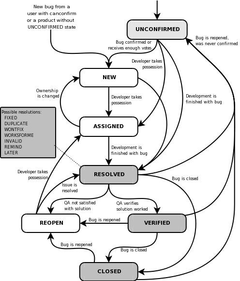

# PURPOSE.

The purpose of this test procedure is to provide guidance to the Quality
Assurance and Development Teams when managing defects found in the systems
under test. By following this plan, teams will manage the defects so that
the process is consistent and maintainable, and, to the extent possible,
compliant with industry best practices and conventions.

1.  **SCOPE.**

    All testing stakeholders must follow this standard, whether the testers or
    developers are internal or not, and regardless of where the application was
    developed internally or out sourced.

2.  **Types of Defects.**

3.  **Variance from product specifications (Developer’ point of view)**

    The product varies from the specifications. Example when **A** added to
    **B** is to produce **C** and the product is producing **D**

4.  **Variance from customers expectations (Customer’s point of view)**

    Something that the user wanted but was:

### Not specified in the requirement document.

-   The requirement was incorrectly interpreted.

-   Requirement was omitted.

-   The manner or method by which the requirement was implemented was
    unsatisfactory.

1.  **Attributes of Defects.**

-   **Defect Naming:**

-   Requirement Defect.

-   Design Defect.

-   Documentation Defect.

-   **Severity of Defect:**

-   Critical – Show Stoppers.

-   Major - for instance, incorrect output is delivered.

-   Minor – Spelling Mistakes etc.

-   **Type of Defect:**

-   Wrong – Specifications were implemented incorrectly.

-   Missing – Specifications were not implemented at all.

-   Extra – Specifications implemented correctly but were not requested.

1.  **Defect Log.**

    The following table summarizes what should be included as contents of the
    defect log.

| **Field**                  | **Description**                                                                                                                                                                                                                   |
|----------------------------|-----------------------------------------------------------------------------------------------------------------------------------------------------------------------------------------------------------------------------------|
| **Defect Number**          | Unique identifier for the defect, i.e., 1,2 etc.                                                                                                                                                                                  |
| **Date Created**           | Date on which the defect was initially reported and logged.                                                                                                                                                                       |
| **Created By**             | Name of the person who reported the defect.                                                                                                                                                                                       |
| **Defect Description**     | Description of the defect. State the subsystem, area, or other part of the product in which the defect occurs or which is affected by the defect.                                                                                 |
| **PM Process**             | Choose the Project Management Process this defect was reported for: Opportunity Assessment, Initiating, Planning, Executing/Controlling and Closing.                                                                              |
| **Lifecycle Phase**        | List the lifecycle this defect was reported for. The Software Development lifecycle is: Opportunity Assessment, Concept, Requirements, Design, Development, Testing, Documentation and Training, Deployment and Post Deployment.  |
| **Priority**               | The priority code indicates the impact of this defect on the project:                                                                                                                                                             |
|                            | **H** = High (extremely important, the project cannot be successful without this defect being resolved)                                                                                                                           |
|                            | **M** = Medium (important to project success, but a work around exists)                                                                                                                                                           |
|                            | **L** = Low (desirable, but with little impact to project success if the defect is not resolved)                                                                                                                                  |
| **Owner**                  | Name of the person who is responsible for fixing the defect.                                                                                                                                                                      |
| **Assigned Date**          | Date on which the defect was assigned for resolution.                                                                                                                                                                             |
| **Estimated Time To Fix**  | Estimated amount of time required to correct the defect. If applicable list in hours, not days.                                                                                                                                   |
| **Status**                 | Current status of the defect: New, In Progress, Under Review and Completed.                                                                                                                                                       |
| **Resolution**             | Description of the defect’s resolution.                                                                                                                                                                                           |
| **Resolution Date**        | Date on which the defect is to be resolved (or is resolved depending upon its status).                                                                                                                                            |
| **Actual Time to Fix**     | Actual time required to correct the defect.                                                                                                                                                                                       |
| **Root Cause Description** | State the cause of the defect (for example, communication, oversight, transcription, education, process, bad code.).                                                                                                              |

2.  **RESPONSIBILITIES.**

    The development team and the testing team should work together to ensure
    that this defect management process runs as expected.

3.  **DEFINITIONS.**

| **TL**  | **Test Lead**               |
|---------|-----------------------------|
| **PL**  | **Project Lead**            |
| **DTS** | **Defect Tracking System.** |
| **QA**  | **Quality Assurance.**      |

4.  **PROCEDURE.**

## The steps below describe a simple defect tracking process:

-   Execute the test and compare the actual results to the documented expected
    results.

-   If discrepancy exists, log the discrepancy with a status of “open”. Ensure
    you attach supplementary documentations such as screenshots.

-   The Test Manager or Test Lead should review the problem log with the
    appropriate members of the Defect Triage Meeting to determine if the
    discrepancy is truly a defect.

-   Assign the defect to a developer for correction.

-   Once the defect is corrected, the developer will usually enter a description
    of the fix applied and update the defect status to” Fixed”.

-   The defect is routed back to the test team for retesting.

-   Additional regression testing is performed as needed based on the severity
    and impact of the fix applied.

-   If the retest result match the expected result, the defect status is updated
    to ”closed”. If the test results indicate that the defect is still not
    fixed, the status is changed to “open” and sent back to the developer.

    **FLOWCHART 1: A SIMPLIFIED BUG CYLCE.**

1.  New Bugs and enhancements are submitted in the Defect tracking system(HP
    Quality Center) account by the QA.

2.  Team Leader assigns priority to new Bugs and priority is updated in DTS.

3.  Development Team fixes bugs according to the priority assign, and changes
    the status to ‘Fixed’

4.  Development Team releases a new internal version, with fixed bugs and new
    features.

5.  QA verifies and checked the bugs in new release, and changes the status.

6.  Fixed bugs are closed in the DTS by QA, Non fixed are ‘Reopened’ in DTS

**FLOWCHART 2: A COMPREHENSIVE BUG CYCLE.**

