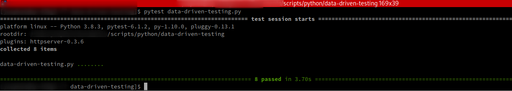

### Example:Data Driven testing Using pytest



### Expected Output



[Here]() you will find the `json` response for the above test script.

### Code
The script is show below in case using chrome and it isn't rendering the gist
```python
import requests
import pytest
import csv

from requests.exceptions import HTTPError

test_data_users = [
("1","George","Bluth","george.bluth@reres.in"),
("2","Janet","Weaver","janet.weaver@reqres.in")
]

@pytest.mark.parametrize("id,first_name,last_name, expected_email", test_data_users)
def test_using_data_object_get_user_id_check_email(id,first_name,last_name,expected_email):
  try:
    response = requests.get(f"https://reqres.in/api/users/{id}")

    jsonResponse = response.json()
    email = jsonResponse['data']['email']

    assert email == expected_email

  except  HTTPError as http_err:
    print(f'HTTP error occurred: {http_err}')
  except Exception as err:
    print(f'Other error occurred: {err}')

def read_test_data_from_csv():
  test_data = []
  filename = 'users.csv'
  try:
    with open(filename,newline='') as csvfile:
      data = csv.reader(csvfile,delimiter=',')
      next(data) # skip the header
      for row in data:
        test_data.append(row)
    return test_data

  except FileNotFoundError:
    print('File not found',filename)
  except Exception as e:
    print(e)

@pytest.mark.parametrize("id,first_name,last_name, expected_email", read_test_data_from_csv())
def test_using_csv_get_user_id_check_email(id,first_name,last_name,expected_email):
  try:
    response = requests.get(f"https://reqres.in/api/users/{id}")

    jsonResponse = response.json()
    email = jsonResponse['data']['email']

    assert email == expected_email

  except  HTTPError as http_err:
    print(f'HTTP error occurred: {http_err}')
  except Exception as err:
    print(f'Other error occurred: {err}')

## To Run
# $ pytest data-driven-testing.py
```


